# 🌿 DermDoc-AI  
**Smart Skincare Ingredient Validator & Seller Approval System**

<p align="center">
  
  <br>
  <i style="font-size:18px; color:#555;">Discover the truth behind skincare products with DermDoc-AI</i>
</p>


## 🎬 Demo Video

[](https://drive.google.com/file/d/1bv3t99bTWJkV76nUm-NkvesFGWMzpOZW/view?usp=sharing)  
Click above to watch the full demo of DermDoc-AI in action.

---

## ✨ Introduction

Even if a skincare product claims to be **pure and organic**, the truth lies in its ingredients. Users cannot check every ingredient manually, and most products sold online contain hidden inorganic chemicals. DermDoc-AI was born to **empower users**, **validate ingredients**, and **ensure only safe products reach consumers**.  

---

## 🌟 Key Features

### 🔍 Ingredient Validation for Users
* Scan any skincare product image or upload ingredient lists.  
* Get **safety status** (Green/Red/Yellow) for each product.  
* Check **skin-type compatibility** (Oily, Normal, Combination).  

### 🛒 Seller Product Validation
* Sellers can **register and upload products** with ingredient lists.  
* System **automatically approves safe products** and **rejects unsafe ones**.  
* Only **approved and safe products** are shown in the **user dashboard**; rejected products are hidden to maintain **user trust**.  
* Both approved and rejected products receive **detailed AI explanations** for ingredient safety assessment.  

### 🧠 AI-Powered Evaluation
* **Hermes-2 Pro** evaluates ingredient lists contextually and decides overall product safety.  
* **Groq AI** provides **explanations using web scraping data**, helping users and sellers understand ingredient risks.  
* Generates **rejection reasons or suggestions for product improvement** for unsafe products.  

### 💾 Database & Product Management
* **PostgreSQL/MySQL** stores ingredients, products, and seller information.  
* Structured tables include ingredient info, skin-type tables, alternatives, seller info, and product submissions.  
* Ensures **fast lookup**, **secure storage**, and transparent product listing.  

### 🌐 Web Scraping & Knowledge Base
* **BeautifulSoup + ScraperAPI** extract ingredient data from multiple sources.  
* Build a comprehensive **ingredient and alternative knowledge base**.  

### 🚀 User & Seller Experience
* Users get **instant validation and compatibility checks**.  
* Sellers get **automatic approval or rejection** with **clear AI-generated feedback**.  
* Maintains **trustworthy and safe product listings** on the platform.


## 📱 App Screenshots & Demos


### Initial App Flow

<table>
  <tr class="screenshot-row">
    <td class="screenshot-cell" colspan="2">
      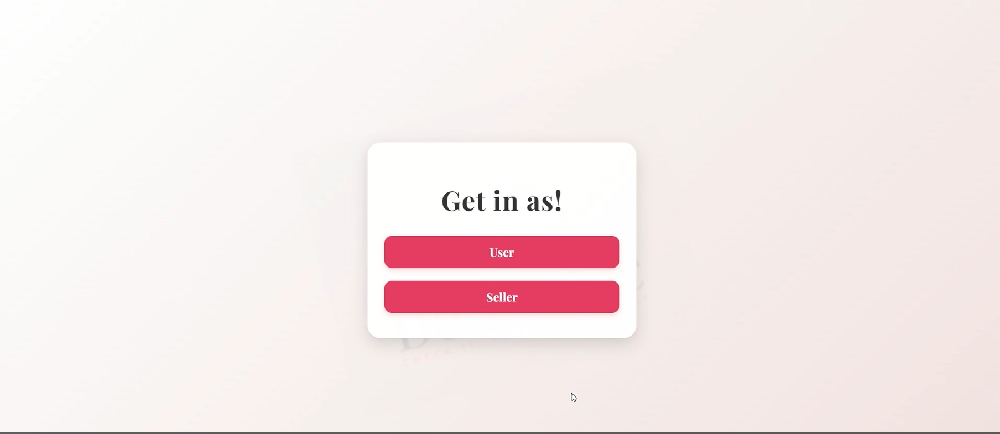<br>
      <i>Choose to login as user or seller</i>
    </td>
  </tr>
</table>


---

### 📝 Seller Onboarding & Login

<table>
  <tr class="screenshot-row">
    <td class="screenshot-cell">
      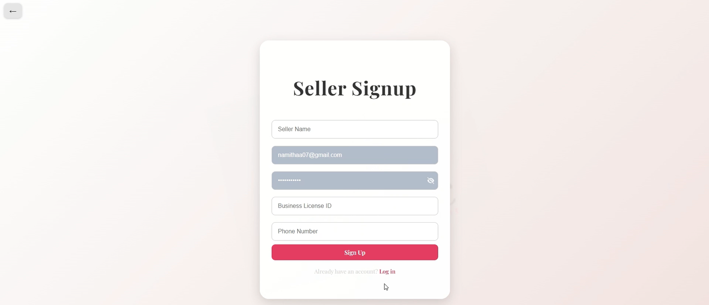<br>
      <i>Seller signup</i>
    </td>
    <td class="screenshot-cell">
      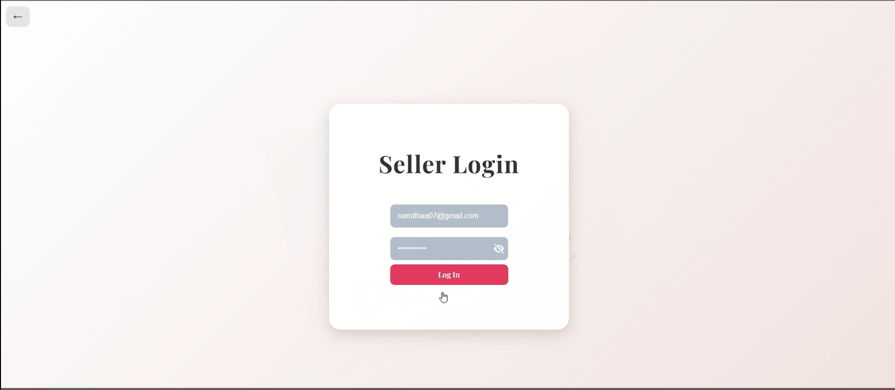<br>
      <i>Seller login</i>
    </td>
  </tr>
</table>

---

### 📤 Product Upload & Overview

<table>
  <tr class="screenshot-row">
    <td class="screenshot-cell">
      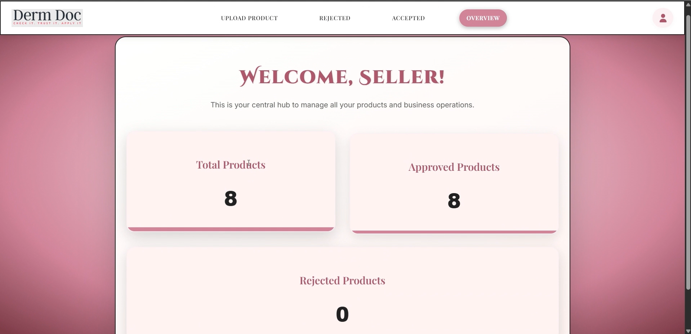<br>
      <i>Product counts overview</i>
    </td>
    <td class="screenshot-cell">
      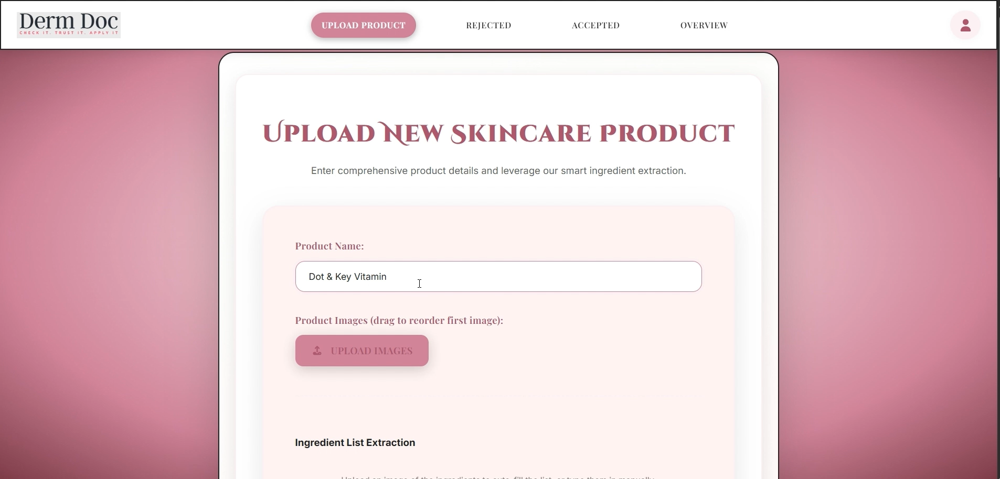<br>
      <i>Seller upload product </i>
    </td>
  </tr>
  <tr class="screenshot-row">
    <td class="screenshot-cell">
      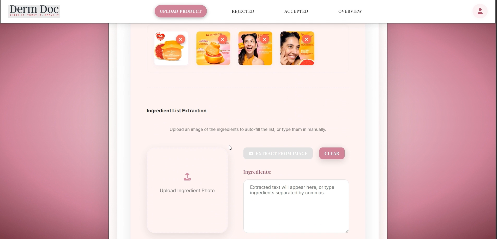<br>
      <i>Seller upload product</i>
    </td>
    <td class="screenshot-cell">
      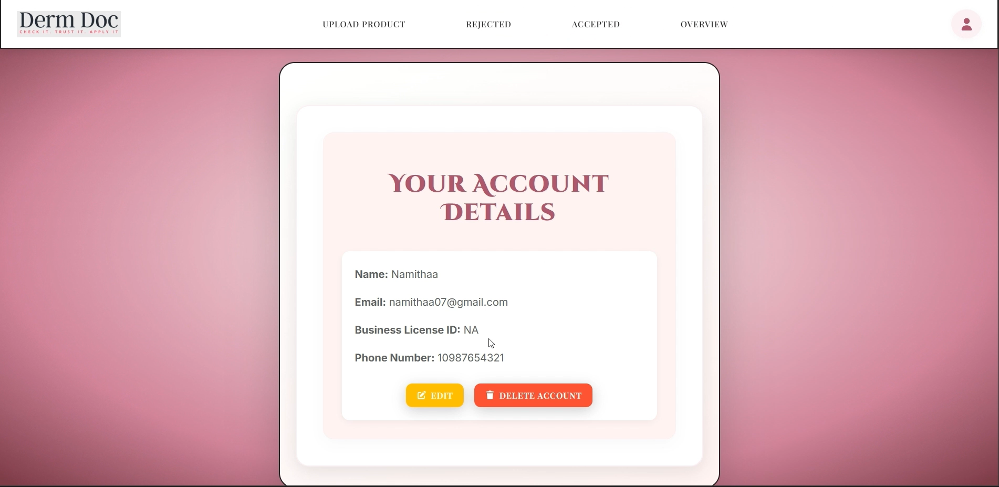<br>
      <i>Edit seller account</i>
    </td>
  </tr>
  <tr class="screenshot-row">
    <td class="screenshot-cell">
      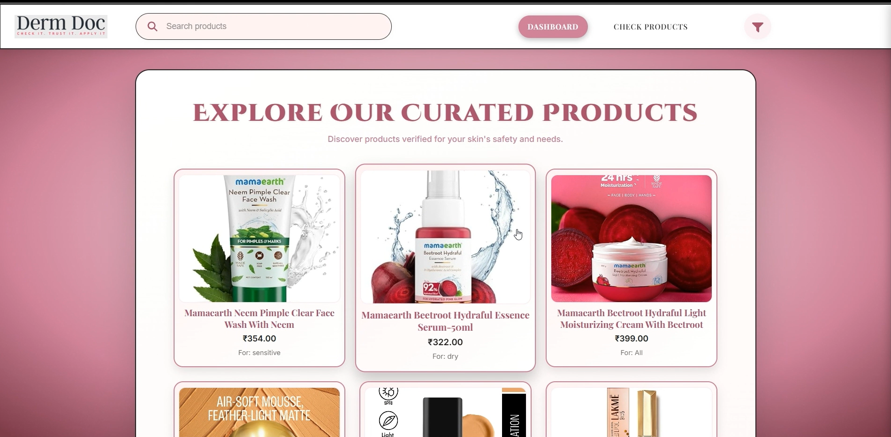<br>
      <i>User dashboard</i>
    </td>
    <td class="screenshot-cell">
      <!-- You can leave this empty if no image -->
    </td>
  </tr>
</table>

---

### 🤖 Product Evaluation & AI Explanation

<table>
  <tr class="screenshot-row">
    <td class="screenshot-cell">
      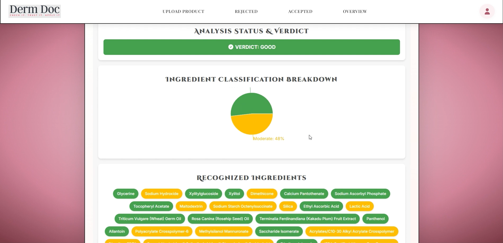<br>
      <i>Product verdict & ingredient classification</i>
    </td>
    <td class="screenshot-cell">
      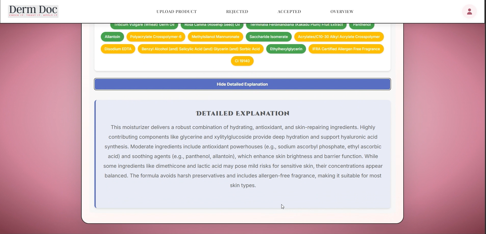<br>
      <i>AI explanation of ingredients</i>
    </td>
  </tr>
</table>

---

### ✅ Product Approval Status

<table>
  <tr class="screenshot-row">
    <td class="screenshot-cell">
      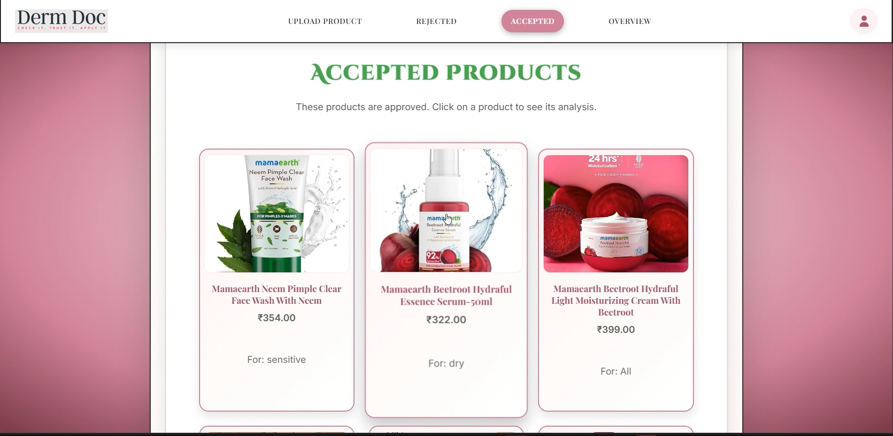<br>
      <i>Accepted products</i>
    </td>
    <td class="screenshot-cell">
      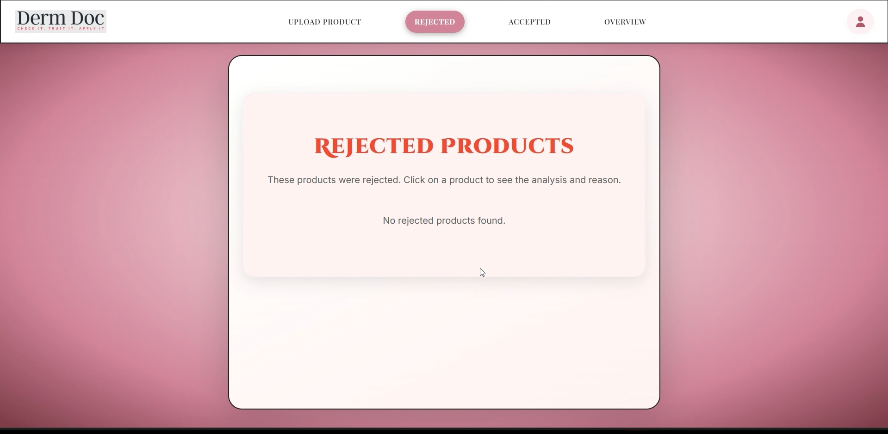<br>
      <i>Rejected products</i>
    </td>
  </tr>
</table>

---

###🔍  User Dashboard & Product Search

<table>
  <tr class="screenshot-row">
    <td class="screenshot-cell">
      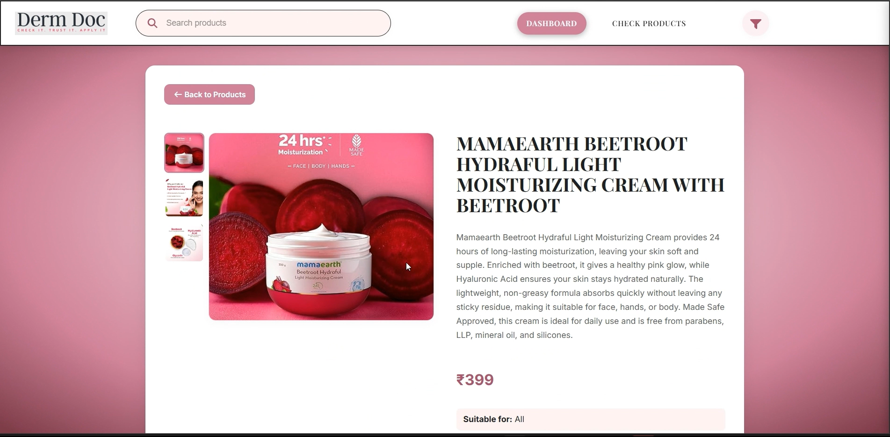<br>
      <i>User dashboard product overview</i>
    </td>
    <td class="screenshot-cell">
      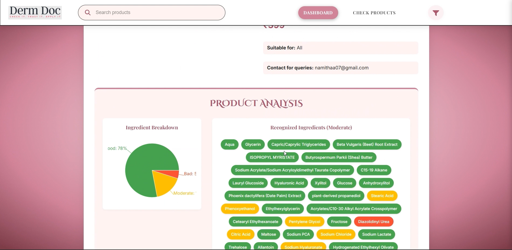<br>
      <i>Product verdict in user dashboard</i>
    </td>
  </tr>
  <tr class="screenshot-row">
    <td class="screenshot-cell">
      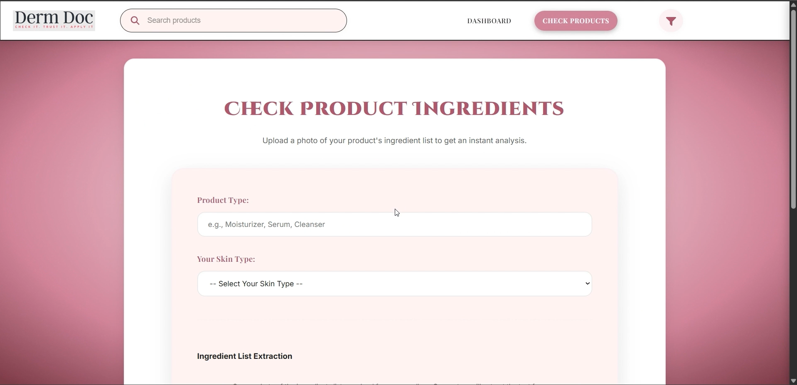<br>
      <i>User check product</i>
    </td>
    <td class="screenshot-cell">
      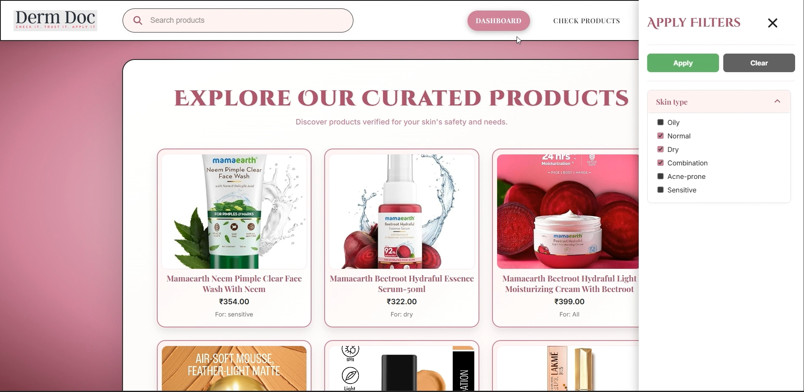<br>
      <i>Filter products</i>
    </td>
  </tr>
  <tr class="screenshot-row">
    <td class="screenshot-cell">
      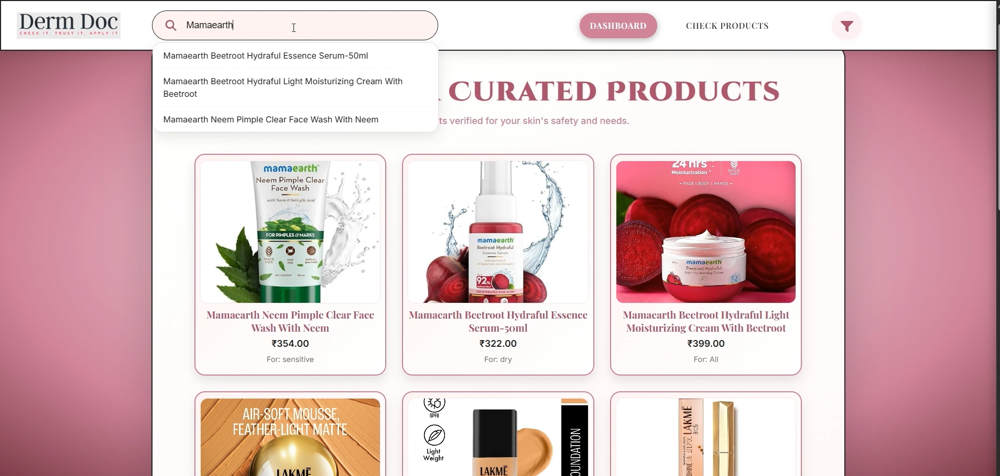<br>
      <i>Search products</i>
    </td>
  </tr>
</table>


## 🧰 Technology Stack

**Frontend:** React, Tailwind CSS  
**Backend:** Python (Flask/FastAPI)  
**Database:** PostgreSQL  
**OCR & AI Tools:** EasyOCR, Hermes-2 Pro, Groq AI  
**Web Scraping:** BeautifulSoup + ScraperAPI  

<p align="center">
  
  
  
  
  
  
  
  
  
</p>

---

## 🚀 Setup and Installation

### Clone the Repository

```bash
git clone https://github.com/namithaa0710/DermDoc-AI.git
cd DermDoc-AI


